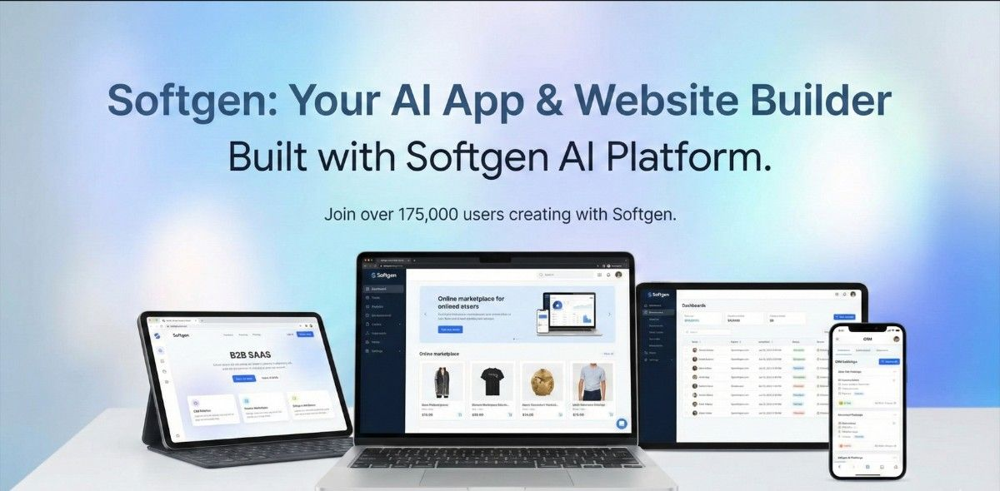

# داريوم - منصة إدارة العقارات الذكية
# Daryum - Smart Property Management Platform

**نظام تشغيل متكامل لإدارة العقارات المؤجرة في السعودية**

[العربية](#نظرة-عامة) | [English](#overview)

---

## 🇸🇦 النسخة العربية

### نظرة عامة

**داريوم** هي منصة سحابية متكاملة مصممة خصيصاً للسوق السعودي لإدارة العقارات والوحدات السكنية المؤجرة. تجمع المنصة بين إدارة الحجوزات، التشغيل اليومي، التقارير المالية، والذكاء الاصطناعي في نظام واحد سهل الاستخدام.

### 🎯 المشكلة التي نحلها

مدراء العقارات في السعودية يواجهون:
- **تشتت الأنظمة**: استخدام 5-7 أدوات منفصلة للحجوزات، المحاسبة، الصيانة، والتنظيف
- **بيانات غير متزامنة**: تأخير في تحديث الحجوزات والأسعار عبر القنوات المختلفة
- **عدم وضوح الأداء**: صعوبة فهم الإيرادات والإشغال الحقيقي للمحفظة
- **تحديات الامتثال**: التعامل مع ضريبة القيمة المضافة وتقارير الملاك بشكل يدوي

### ✨ الحل: داريوم

منصة واحدة تجمع كل شيء:
- ✅ مزامنة فورية مع Airbnb وBooking.com وقنوات الحجز الأخرى
- ✅ تقارير مالية متوافقة مع ضريبة القيمة المضافة السعودية
- ✅ لوحة تحكم تنفيذية بمؤشرات أداء لحظية
- ✅ إدارة تلقائية للتنظيف والصيانة
- ✅ تقارير مفصلة للملاك والمستثمرين
- ✅ ذكاء اصطناعي لتحسين الإشغال والأسعار

---

## 🏢 المستخدمون المستهدفون

### 1. **مدير العقار** (Property Manager)
إدارة شاملة للعمليات اليومية:
- متابعة الوصول والمغادرة
- توزيع مهام التنظيف
- معالجة طلبات الصيانة
- الرد على رسائل الضيوف

### 2. **المالك / المستثمر** (Owner)
تقارير شفافة ومفصلة:
- متابعة الإيرادات والإشغال
- كشوف حساب دورية
- تقارير الأداء بحسب الوحدة
- توقعات الأرباح

### 3. **المحاسب** (Accountant)
أدوات مالية متقدمة:
- مطابقة الإيرادات والمصروفات
- تقارير ضريبة القيمة المضافة
- متابعة العمولات
- كشوف الدفع للملاك

### 4. **مشرف التنظيف** (Housekeeping Supervisor)
إدارة فرق التنظيف:
- توزيع المهام على العمال
- متابعة التقدم
- قوائم فحص الجودة
- جدولة ذكية حسب الحجوزات

### 5. **طاقم الصيانة** (Maintenance Staff)
تتبع طلبات الصيانة:
- تذاكر الصيانة حسب الأولوية
- تقدير التكاليف
- متابعة وقت الاستجابة
- سجل كامل للأعمال

### 6. **مدير الإيرادات** (Revenue Manager)
تحسين الأداء المالي:
- تحليل الأسعار والإشغال
- مقارنة أداء القنوات
- اقتراحات التسعير الذكية
- تقارير المنافسة

---

## 📊 الوحدات الرئيسية

### 1. **لوحة التحكم التنفيذية** (Dashboard)
- مؤشرات الأداء الرئيسية (KPIs) لحظية
- رسوم بيانية للإيرادات والإشغال
- عمليات اليوم (وصول، مغادرة، تنظيف)
- رؤى ذكية من الذكاء الاصطناعي
- حالة الربط مع القنوات

**المؤشرات الرئيسية:**
- إجمالي الإيرادات (SAR)
- معدل الإشغال (%)
- متوسط السعر لليلة (ADR)
- الإيراد لكل غرفة متاحة (RevPAR)
- الوصول والمغادرة القادمة
- مهام التنظيف المعلقة
- طلبات الصيانة المفتوحة

### 2. **إدارة العقارات** (Properties)
إدارة كاملة لمحفظة العقارات:
- إضافة/تعديل/حذف العقارات
- تفاصيل شاملة (الموقع، النوع، المرافق)
- صور وأوصاف تفصيلية
- تصنيف حسب المدينة والنوع
- ربط الملاك بالعقارات
- ملخص الإشغال والإيرادات لكل عقار

### 3. **إدارة الوحدات** (Units)
تفاصيل دقيقة لكل وحدة:
- معلومات الوحدة (نوع، مساحة، طابق)
- حالة الإشغال (متاح، مشغول، تنظيف، صيانة)
- التسعير الديناميكي
- عدد الغرف والحمامات
- السعة القصوى
- صور ووسائط متعددة

### 4. **إدارة الحجوزات** (Reservations)
نظام حجوزات شامل:
- حجوزات من جميع القنوات في مكان واحد
- تفاصيل الضيف كاملة
- حالة الحجز (مؤكد، قيد الانتظار، ملغي)
- تسجيل دخول/خروج
- المدفوعات والمستحقات
- ملاحظات خاصة

**المصادر المدعومة:**
- Airbnb
- Booking.com
- Agoda
- Vrbo
- Expedia
- حجوزات مباشرة

### 5. **التقويم** (Calendar)
عرض بصري لجميع الحجوزات:
- تقويم شهري/أسبوعي/يومي
- السحب والإفلات لتعديل الحجوزات
- ألوان مختلفة لكل قناة حجز
- عرض الأسعار
- مؤشرات التنظيف والصيانة
- تعدد العقارات في شاشة واحدة

### 6. **القنوات** (Channels)
إدارة التكاملات:
- حالة الاتصال بكل قناة
- إحصائيات الأداء لكل قناة
- نسبة الحجوزات من كل مصدر
- معدل التحويل
- متوسط قيمة الحجز
- حالة المزامنة

### 7. **الرسائل** (Messages)
صندوق وارد موحد للتواصل:
- جميع رسائل الضيوف في مكان واحد
- ردود جاهزة ذكية بالذكاء الاصطناعي
- تصنيف حسب الأولوية
- تتبع وقت الاستجابة (SLA)
- دعم متعدد اللغات
- قوالب رسائل

### 8. **التنظيف** (Housekeeping)
إدارة احترافية للتنظيف:
- لوحة مهام على شكل Kanban
- توزيع المهام على العمال
- قوائم فحص الجودة
- حالة التقدم الفورية
- صور قبل وبعد
- جدولة تلقائية حسب الحجوزات

**حالات المهام:**
- قيد الانتظار
- جاري التنفيذ
- مكتمل
- يتطلب إعادة فحص

### 9. **الصيانة** (Maintenance)
نظام تذاكر صيانة متكامل:
- إنشاء طلبات صيانة
- تحديد الأولوية (عادي، عاجل، طارئ)
- تخصيص للمسؤولين
- تقدير وتتبع التكاليف
- تاريخ الصيانة لكل وحدة
- وقت الاستجابة (SLA)

**الأولويات:**
- عاجل (يؤثر على الحجوزات)
- عالي (يجب الحل قريباً)
- متوسط (روتيني)
- منخفض (تحسينات)

### 10. **الملاك** (Owners)
إدارة علاقات الملاك:
- كشوف حساب دورية
- ملخص الإيرادات والمصروفات
- دورات الدفع
- مساهمة كل وحدة في الأرباح
- تقارير قابلة للتحميل
- تاريخ المدفوعات

### 11. **المالية** (Finance)
إدارة مالية شاملة:
- مطابقة الإيرادات
- ملخصات ضريبة القيمة المضافة
- أرصدة الملاك
- العمولات والخصومات
- سجل المعاملات
- حالة الدفعات

**التقارير المالية:**
- تقرير الإيرادات الشهري
- كشوف الملاك
- ملخص ضريبة القيمة المضافة
- تحليل العمولات
- الربحية بحسب الوحدة

### 12. **التقارير** (Reports)
تحليلات متقدمة:
- أداء المحفظة الكامل
- مقارنة أداء القنوات
- الإيرادات حسب الوحدة
- الإشغال حسب الفترة
- تصدير Excel/PDF
- فلاتر ومقارنات مرنة

### 13. **الأتمتة** (Automations)
أتمتة ذكية للمهام:
- قواعد الرسائل التلقائية
- إطلاق مهام التنظيف
- تنبيهات الأسعار
- إشعارات الفريق
- تذكيرات الدفع
- تقارير دورية

### 14. **التكاملات** (Integrations)
ربط مع الأدوات الخارجية:
- قنوات الحجز (OTAs)
- بوابات الدفع
- الأقفال الذكية
- WhatsApp للتواصل
- أنظمة المحاسبة
- حالة المزامنة الفورية

### 15. **الإعدادات** (Settings)
تخصيص كامل للنظام:
- إعداد مساحة العمل
- إدارة المستخدمين والأدوار
- إعدادات العلامة التجارية
- ضريبة القيمة المضافة والفواتير
- التفضيلات اللغوية (عربي/إنجليزي)
- قواعد الإشعارات

---

## 🤖 طبقة الذكاء الاصطناعي

### رؤى تشغيلية ذكية:
- **تحسين الأسعار**: اقتراحات لرفع/تخفيض السعر حسب الطلب والإشغال
- **كشف الفجوات**: تنبيه بفترات انخفاض الحجوزات المحتملة
- **ردود تلقائية**: اقتراحات رد ذكية على رسائل الضيوف
- **كشف المشاكل**: تحديد طلبات الصيانة المتكررة
- **تحليل الأداء**: تحديد الوحدات ضعيفة الأداء
- **فرص الأتمتة**: اقتراح قواعد أتمتة جديدة

### أمثلة من التوصيات:
> "نقترح رفع السعر بنسبة 8% في عطلة نهاية الأسبوع القادمة بناءً على الطلب الحالي ومعدل الإشغال."

> "الوحدة A-304 لديها معدل إلغاء أعلى من المتوسط. نقترح مراجعة الصور والوصف."

> "تم رصد 3 طلبات صيانة متشابهة في عقار الفيصلية خلال شهر. ربما يحتاج العقار لفحص شامل."

---

## 🇸🇦 التوطين السعودي

### مصمم للسوق السعودي:
✅ **واجهة عربية أصيلة**: ليست مترجمة، بل مصممة بالعربية من الأساس  
✅ **تنسيق الريال السعودي**: عرض جميع المبالغ بـ SAR  
✅ **ضريبة القيمة المضافة**: تقارير جاهزة متوافقة مع المتطلبات السعودية  
✅ **منطق الأعمال المحلي**: يراعي عطلات نهاية الأسبوع والمواسم السعودية  
✅ **تكامل WhatsApp**: التواصل المفضل في السوق السعودي  
✅ **لغة ثنائية**: تبديل سلس بين العربية والإنجليزية  

---

## 💎 المزايا التنافسية

### لماذا داريوم؟

#### 1. **منصة واحدة متكاملة**
- لا حاجة لـ 5-7 أدوات منفصلة
- بيانات متزامنة في الوقت الفعلي
- تجربة مستخدم موحدة

#### 2. **مصمم للسوق السعودي**
- ليس مجرد ترجمة لمنتج عالمي
- امتثال كامل للوائح المحلية
- دعم فني بالعربية

#### 3. **ذكاء اصطناعي عملي**
- رؤى قابلة للتنفيذ، ليست مجرد تحليلات
- توصيات بناءً على بيانات حقيقية
- أتمتة ذكية توفر الوقت

#### 4. **تجربة مستخدم راقية**
- تصميم premium احترافي
- واجهة سهلة الاستخدام
- أداء سريع وموثوق

#### 5. **شفافية كاملة للملاك**
- تقارير تفصيلية دورية
- بيانات لحظية
- ثقة وشفافية في العلاقات

---

## 🔐 الأمان والخصوصية

- **تشفير شامل**: جميع البيانات مشفرة أثناء النقل والتخزين
- **نسخ احتياطي يومي**: استعادة كاملة للبيانات في حالات الطوارئ
- **صلاحيات مفصلة**: تحكم دقيق في من يرى ماذا
- **سجلات التدقيق**: تتبع كامل لجميع التعديلات
- **امتثال GDPR**: حماية بيانات المستخدمين والضيوف

---

## 📱 الوصول والتوافق

### منصات مدعومة:
- ✅ متصفحات الويب (Chrome, Safari, Edge, Firefox)
- ✅ أجهزة سطح المكتب (Windows, macOS)
- ✅ الأجهزة اللوحية (iPad, Android tablets)
- ✅ الهواتف الذكية (تصميم متجاوب كامل)

### متطلبات النظام:
- اتصال إنترنت مستقر
- متصفح حديث (آخر إصدارين)
- دقة شاشة 1280x720 كحد أدنى (موصى به: 1920x1080)

---

## 🚀 التقنيات المستخدمة

### Frontend:
- **Next.js 15** - React framework للأداء الأمثل
- **TypeScript** - سلامة الأنواع البرمجية
- **Tailwind CSS** - تصميم responsive سريع
- **shadcn/ui** - مكونات UI راقية
- **Recharts** - رسوم بيانية تفاعلية

### Backend:
- **Supabase** - قاعدة بيانات وخادم في الوقت الفعلي
- **PostgreSQL** - قاعدة بيانات قوية وموثوقة
- **Row Level Security** - أمان على مستوى الصف

### Infrastructure:
- **Vercel** - استضافة سحابية عالية الأداء
- **Edge Functions** - استجابة سريعة عالمياً
- **CDN** - توصيل محتوى سريع

---

## 📞 الدعم والتواصل

### للاستفسارات والدعم:
- 📧 **البريد الإلكتروني**: support@daryum.com
- 💬 **WhatsApp**: +966 XX XXX XXXX
- 🌐 **الموقع**: www.daryum.com
- 📍 **المقر**: الرياض، المملكة العربية السعودية

---

## 📈 خطط التسعير

### خطط مرنة تناسب جميع الأحجام:

**Starter** - للمبتدئين
- حتى 10 وحدات
- ميزات أساسية
- دعم عبر البريد

**Professional** - للمحترفين
- حتى 50 وحدة
- جميع الميزات
- دعم ذو أولوية
- تقارير متقدمة

**Enterprise** - للشركات الكبرى
- وحدات غير محدودة
- حلول مخصصة
- دعم مخصص 24/7
- API مخصص

---

## 🎯 الرؤية المستقبلية

نحن نعمل باستمرار على:
- ✨ تكاملات جديدة مع أنظمة PMS عالمية
- 📱 تطبيقات جوال native (iOS & Android)
- 🤖 ذكاء اصطناعي أكثر تطوراً
- 📊 تحليلات تنبؤية
- 🔗 API مفتوح للمطورين
- 🌍 توسع إقليمي (الخليج والشرق الأوسط)

---

**داريوم - نظام تشغيل ذكي لعقاراتك**

صُنع بـ ❤️ في السعودية

---

---

## 🇬🇧 English Version

### Overview

**Daryum** is a comprehensive cloud-based platform designed specifically for the Saudi market to manage rental properties and units. The platform combines reservation management, daily operations, financial reporting, and artificial intelligence in one easy-to-use system.

### 🎯 Problem We Solve

Property managers in Saudi Arabia face:
- **Fragmented Systems**: Using 5-7 separate tools for reservations, accounting, maintenance, and cleaning
- **Unsynchronized Data**: Delays in updating bookings and prices across different channels
- **Unclear Performance**: Difficulty understanding actual revenue and occupancy of the portfolio
- **Compliance Challenges**: Manually handling VAT and owner reports

### ✨ Solution: Daryum

One platform for everything:
- ✅ Real-time sync with Airbnb, Booking.com, and other booking channels
- ✅ Financial reports compliant with Saudi VAT
- ✅ Executive dashboard with real-time KPIs
- ✅ Automated cleaning and maintenance management
- ✅ Detailed reports for owners and investors
- ✅ AI for occupancy and pricing optimization

---

## 👥 Target Users

1. **Property Manager** - Comprehensive daily operations management
2. **Owner/Investor** - Transparent detailed reports
3. **Accountant** - Advanced financial tools
4. **Housekeeping Supervisor** - Team management
5. **Maintenance Staff** - Work order tracking
6. **Revenue Manager** - Performance optimization

---

## 📊 Core Modules

### 1. **Executive Dashboard**
Real-time KPIs, charts, daily operations, AI insights, channel status

### 2. **Properties Management**
Complete portfolio management with details, images, classification

### 3. **Units Management**
Detailed unit info, occupancy status, dynamic pricing

### 4. **Reservations**
All channels in one place, guest details, payment tracking

### 5. **Calendar**
Visual view, drag-and-drop, multi-property support

### 6. **Channels**
Integration management, performance stats, sync status

### 7. **Messages**
Unified inbox, AI replies, SLA tracking

### 8. **Housekeeping**
Kanban board, task distribution, quality checklists

### 9. **Maintenance**
Ticket system, priority management, cost tracking

### 10. **Owners**
Statements, revenue summary, payout cycles

### 11. **Finance**
Revenue reconciliation, VAT, commissions, transactions

### 12. **Reports**
Advanced analytics, export capabilities, comparisons

### 13. **Automations**
Smart rules for messages, tasks, pricing, notifications

### 14. **Integrations**
OTAs, payment gateways, smart locks, WhatsApp, accounting

### 15. **Settings**
Workspace setup, users & roles, branding, VAT, languages

---

## 🤖 AI Layer

### Smart Operational Insights:
- Pricing optimization
- Gap detection
- Auto-responses
- Problem detection
- Performance analysis
- Automation opportunities

---

## 🇸🇦 Saudi Localization

✅ Native Arabic interface (not translated)
✅ SAR formatting
✅ VAT-compliant reports
✅ Saudi business logic (weekends, seasons)
✅ WhatsApp integration
✅ Bilingual (Arabic/English)

---

## 💎 Competitive Advantages

1. **One Integrated Platform** - No need for 5-7 separate tools
2. **Saudi Market Design** - Not just a translation
3. **Practical AI** - Actionable insights
4. **Premium UX** - Professional design
5. **Owner Transparency** - Detailed periodic reports

---

## 🔐 Security & Privacy

- End-to-end encryption
- Daily backups
- Granular permissions
- Audit logs
- GDPR compliant

---

## 📱 Access & Compatibility

✅ Web browsers
✅ Desktop (Windows, macOS)
✅ Tablets (iPad, Android)
✅ Smartphones (fully responsive)

---

## 🚀 Technology Stack

**Frontend:** Next.js 15, TypeScript, Tailwind CSS, shadcn/ui, Recharts
**Backend:** Supabase, PostgreSQL, Row Level Security
**Infrastructure:** Vercel, Edge Functions, CDN

---

## 📞 Support & Contact

📧 support@daryum.com
💬 WhatsApp: +966 XX XXX XXXX
🌐 www.daryum.com
📍 Riyadh, Saudi Arabia

---

## 📈 Pricing Plans

**Starter** - Up to 10 units
**Professional** - Up to 50 units
**Enterprise** - Unlimited units

---

## 🎯 Future Vision

- New PMS integrations
- Native mobile apps
- Advanced AI
- Predictive analytics
- Open API
- Regional expansion

---

**Daryum - Smart Operating System for Your Properties**

Made with ❤️ in Saudi Arabia

